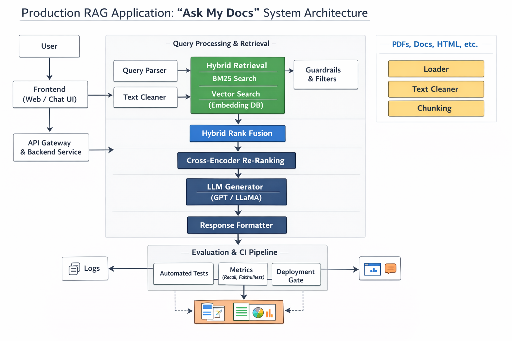

# 🧠 Production RAG Application - Ask My Docs
<p align="center">
  
</p>
## 🚀 Overview
A production-style Retrieval-Augmented Generation (RAG) system with:
- Hybrid Retrieval (BM25 + Vector Search)
- Cross-Encoder Reranking
- Citation Enforcement
- CI/CD Evaluation Pipeline

## 🏗️ Architecture
- FastAPI backend
- FAISS (vector search)
- BM25 (keyword search)
- Ollama (local LLM)

## ⚙️ Setup

### 1. Install dependencies
```bash
pip install -r requirements.txt
